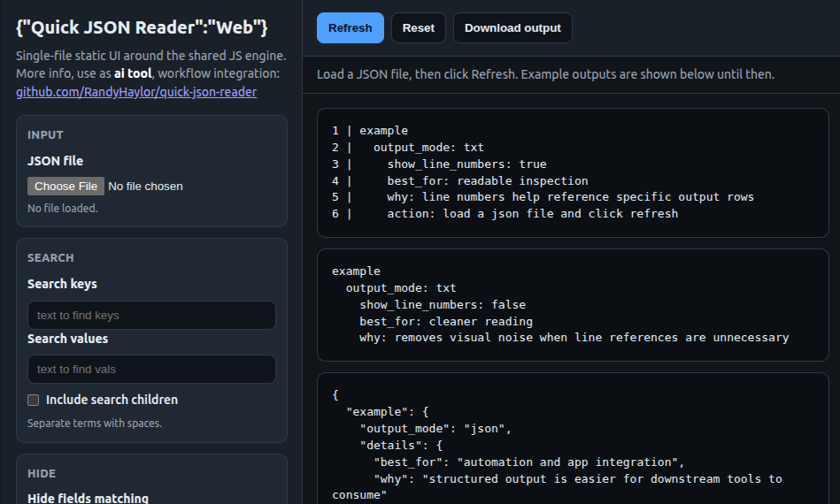

# Quick JSON Reader
## cli | ai tool integration | logging | data viewing and inspection

TRY IT HERE!  [randyhaylor.github.io/jsonreader/](https://randyhaylor.github.io/jsonreader/)

<a href="https://randyhaylor.github.io/jsonreader/">
  
</a>

> Fast JSON search tool with compact outputs for AI, logging, and application workflows—portable and easy to extend.

## Contents

<table>
<tr>
<td valign="top">

- [Mission](#mission)
- [Implementations](#implementations)
- [Overview](#overview)
- [Runtime Environments](#runtime-environments)
- [Features](#features)

</td>
<td valign="top">

- [CLI Usage](#cli-usage)
- [Browser Usage](#browser-usage)
- [Examples](#examples)
- [Output Behavior](#output-behavior)

</td>
<td valign="top">

- [Data Fidelity](#data-fidelity)
- [Testing](#testing)
- [Release Downloads](#release-downloads)
- [Author](#author)

</td>
</tr>
</table>

## Mission

Provide a simple, powerful, and deterministic tool for humans and AI agents to quickly and efficiently view JSON content.

This tool is designed to make large or complex JSON data immediately understandable, while supporting both full inspection and precise extraction without forcing data loss.

## Implementations

This project serves as a foundational engine for multiple use cases:

- **AI agent tooling** — deterministic JSON projection with explicit search/exclude/stats flags makes outputs easy for agents to parse and act on.
    - Add as a skill for any agent
        - Create a `quick-json-reader` folder inside your agent's `skills/` directory
        - Download [`ai-agent-tool/SKILL.md`](ai-agent-tool/SKILL.md) and [`src/quick_json_reader.js`](src/quick_json_reader.js) into that folder
        - Your agent can now run `node quick-json-reader/quick_json_reader.js <file>.json ...` with any of the documented flags
    - Use the `--output json` and `--show-stats` flags to get structured output + document metrics an agent can reason over without reparsing
    - Combine `--search-keys` / `--search-vals` with `--exclude-fields-matching` to narrow the token budget before feeding content to an LLM
- **JSON reader web modules** — single-file static UI you can drop into any site or embed in a dashboard.
    - Unzip the `quick-json-reader-web.zip` release asset for a ready-to-serve page (HTML + JS only, no backend)
    - Or embed `src/quick_json_reader.js` and call `QuickJsonReader.runWithJsonText(text, config)` from your own page
    - Runs fully client-side — safe for sensitive JSON that should never leave the browser
- **Logging and data automation** — deterministic CLI output slots into shell pipelines, CI, and batch jobs.
    - Pipe straight into downstream tooling: `./quick-json-reader huge.log.json --search-vals error --output csv | your-aggregator`
    - Use `--exclude-fields-matching` to strip PII/secrets before archiving or sharing logs
    - Use `--show-stats` in health-check scripts to alert when char count, nesting depth, or object count drifts outside expected ranges
    - Silent by default; pass `--show-app-log` only when debugging the pipeline itself

## Overview

Quick JSON Reader renders JSON as a clean, indentation-based tree instead of raw JSON formatting.

It acts as a projection layer over JSON:
- Non-destructive by default
- Selectively reductive when explicitly instructed

## Runtime Environments

Quick JSON Reader uses a single JavaScript engine in:

- Node.js for CLI and AI-agent execution
- Browser JavaScript for a static web app

The behavior is intended to remain consistent across environments.

## Features

### Rendering
- Indentation-based tree view
- Line numbers for text output by default
- Optional truncation for text and CSV

### Search
- `--search-keys`
- `--search-vals`
- `--include-search-children`

### Field Exclusion
- `--exclude-fields-matching`
- `--exclude-fields-containing`

### Output Modes
- `txt` (default)
- `csv` (RFC-compliant)
- `json` (machine-safe)

### Schema
- `--show-schema` (standalone only)
- Lightweight inferred structure/type projection
- Not a formal JSON Schema generator

### Stats
- `--show-stats` prepends totals (char count, nesting depth, objects, arrays, json-valid) to the output
- In `--output json` mode the stats are injected as a top-level `jsonStats` object so the result stays valid JSON

## CLI Usage

```bash
node quick_json_reader.js input.json
```

### CLI Examples

All examples below use `examples/sample_easy_json_reader_input.json` as input.

#### Default (txt)

```bash
node src/quick_json_reader.js examples/sample_easy_json_reader_input.json
```

```
 1 | user
 2 |   name: alice
 3 |   token: abc123
 4 |   profile
 5 |     bio: loves synths, math, and "quotes"
 6 |     secretNote: deep hidden note
 7 |   events
 8 |     [0]
 9 |       type: login
10 |       status: ok
11 |     [1]
12 |       type: purchase
13 |       status: failed
14 | system
15 |   status: ok
16 |   long: The quick brown fox jumps over the lazy dog.
```

#### Schema

```bash
node src/quick_json_reader.js examples/sample_easy_json_reader_input.json --show-schema
```

```json
{
  "user": {
    "name": "string",
    "token": "string",
    "profile": {
      "bio": "string",
      "secretNote": "string"
    },
    "events": [
      {
        "type": "string",
        "status": "string"
      }
    ]
  },
  "system": {
    "status": "string",
    "long": "string"
  }
}
```

#### Exclude fields

```bash
node src/quick_json_reader.js examples/sample_easy_json_reader_input.json --exclude-fields-matching token secretNote
```

```
 1 | user
 2 |   name: alice
 3 |   profile
 4 |     bio: loves synths, math, and "quotes"
 5 |   events
 6 |     [0]
 7 |       type: login
 8 |       status: ok
 9 |     [1]
10 |       type: purchase
11 |       status: failed
12 | system
13 |   status: ok
14 |   long: The quick brown fox jumps over the lazy dog.
```

#### Search + include children

```bash
node src/quick_json_reader.js examples/sample_easy_json_reader_input.json --search-vals failed --include-search-children
```

```
1 | user
2 |   events
3 |     [1]
4 |       status: failed
```

#### Show stats

```bash
node src/quick_json_reader.js examples/sample_easy_json_reader_input.json --show-stats
```

```
total char count: 386
nesting depth: 5
total objects: 6
total arrays: 1
json-valid: true
 1 | user
 2 |   name: alice
 3 |   token: abc123
 ...
```

#### JSON output + search-keys

```bash
node src/quick_json_reader.js examples/sample_easy_json_reader_input.json --output json --search-keys status
```

```json
{
  "user": {
    "events": [
      {
        "status": "ok"
      },
      {
        "status": "failed"
      }
    ]
  },
  "system": {
    "status": "ok"
  }
}
```

## Browser Usage

Put these in the same folder:
- `quick_json_reader.js`
- `quick_json_reader_web.html`

Then open the HTML file in a browser.

The browser uses the same engine via:
- `QuickJsonReader.runWithJsonText(jsonText, config)`
- `QuickJsonReader.runWithValue(value, config)`

## Examples

```bash
node quick_json_reader.js input.json --search-vals error timeout
node quick_json_reader.js input.json --search-keys user profile
node quick_json_reader.js input.json --search-keys profile --include-search-children
node quick_json_reader.js input.json --exclude-fields-matching token password
node quick_json_reader.js input.json --output csv
node quick_json_reader.js input.json --output json
node quick_json_reader.js input.json --show-schema
node quick_json_reader.js input.json --show-stats
```

## Output Behavior

| Output | Line Numbers | Truncation | Notes |
|--------|-------------|------------|------|
| txt    | ON (default) | yes | human-readable |
| csv    | OFF (default) | yes | RFC-compliant |
| json   | never | no | machine-safe |

## Data Fidelity

- No data is removed unless explicitly requested
- Search narrows scope but preserves structure
- Exclude fully removes matching fields (and their subtrees) from the output
- JSON output remains usable for downstream tools

## Testing

```bash
node --test test_quick_json_reader.js
```

## Release Downloads

Each tagged release publishes the following prebuilt assets at
<https://github.com/RandyHaylor/quick-json-reader/releases/latest>.
Pick the one for your target platform.

Every archive below unpacks to a single executable named **`quick-json-reader`** (or `quick-json-reader.exe` on Windows), so every usage example is the same regardless of platform — just grab the right archive for your OS/arch.

### Linux x64 — `quick-json-reader-linux-x64.tar.gz`
```bash
tar -xzf quick-json-reader-linux-x64.tar.gz
./quick-json-reader input.json --show-stats
```

### Linux arm64 — `quick-json-reader-linux-arm64.tar.gz`
For aarch64 Linux (Raspberry Pi, ARM VPS, ChromeOS Linux container).
```bash
tar -xzf quick-json-reader-linux-arm64.tar.gz
./quick-json-reader input.json --search-vals error
```

### macOS Apple Silicon — `quick-json-reader-macos-arm64.tar.gz`
For M1/M2/M3 Macs. Unsigned; first run may require right-click → Open to bypass Gatekeeper.
```bash
tar -xzf quick-json-reader-macos-arm64.tar.gz
./quick-json-reader input.json --output json
```

### macOS Intel — `quick-json-reader-macos-x64.tar.gz`
For Intel Macs. Same Gatekeeper note as Apple Silicon.
```bash
tar -xzf quick-json-reader-macos-x64.tar.gz
./quick-json-reader input.json --show-schema
```

### Windows x64 — `quick-json-reader-win-x64.zip`
```powershell
Expand-Archive quick-json-reader-win-x64.zip -DestinationPath .
.\quick-json-reader.exe input.json --exclude-fields-matching token password
```

### Android arm64 (native, static) — `quick-json-reader-android-arm64.tar.gz`
Statically-linked aarch64 binary built via QuickJS. Works in `adb shell`, Termux, and can be bundled under `jniLibs/arm64-v8a/` in an APK for app-side exec.
```bash
tar -xzf quick-json-reader-android-arm64.tar.gz
# adb shell (dev):
adb push quick-json-reader /data/local/tmp/
adb shell /data/local/tmp/quick-json-reader /sdcard/input.json --output json
```

### Static web build — `quick-json-reader-web.zip`
HTML page + shared engine. Unzip and open the HTML in any browser — runs entirely client-side, no server.
```bash
unzip quick-json-reader-web.zip
xdg-open quick_json_reader_web.html   # or open on macOS, start on Windows
```

### Any-Node script (including Android via Termux) — `quick-json-reader-nodejs-script.zip`
Raw engine file + a short README. Needs Node 18+ on the target.
```bash
unzip quick-json-reader-nodejs-script.zip
node quick_json_reader.js input.json --search-keys user --include-search-children
# Termux on Android:
pkg install nodejs && node quick_json_reader.js input.json --show-stats
```

## Author

Randy Haylor
